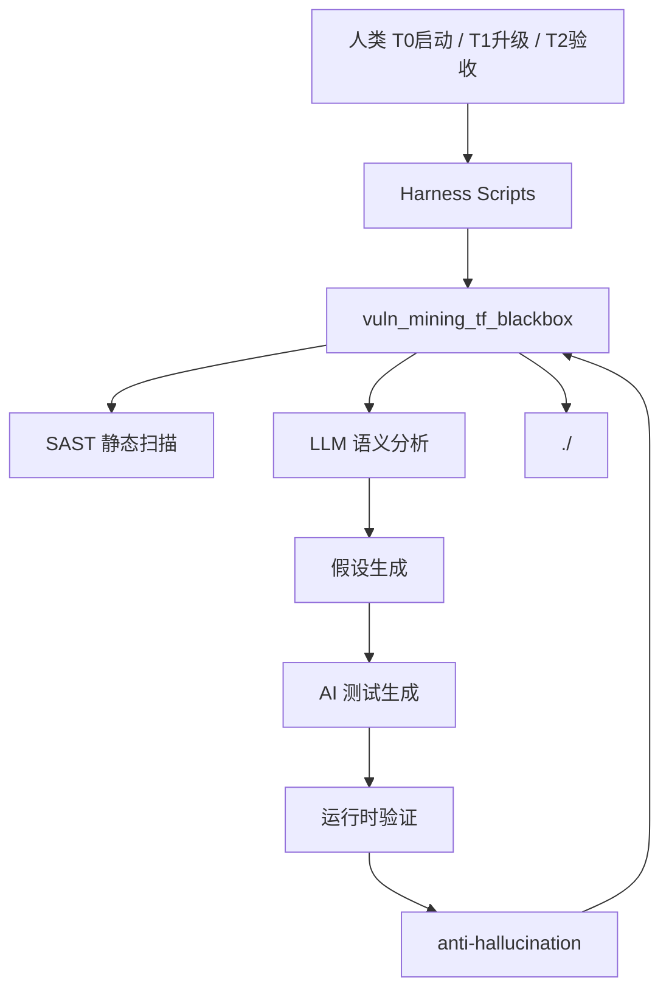

# AI Vulnerability Mining — TensorFlow v2.11.0

基于大模型的系统化漏洞挖掘工具链，针对 TensorFlow C++ 代码库进行黑盒安全审计。

## 特性

- **AI 驱动漏洞扫描** — 利用 LLM 的代码理解能力，发现传统工具难以检测的逻辑漏洞
- **多维度扫描策略** — 输入校验、整数溢出、空指针解引用、资源耗尽、类型混淆、UAF
- **传统+AI 融合** — 结合 SAST/SCA 传统方法与 LLM 语义分析
- **证据链验证** — 每个漏洞必须有源码引用、触发路径和 AI 生成的 PoC
- **幻觉防御网** — anti-hallucination skill + 6 问检查清单确保漏洞真实性
- **完整交互记录** — 所有 LLM 对话完整记录，支持 90% 复现

## 全局架构



## 竞赛交付入口

以仓库根目录的 `INSTRUCTION.md` 为入口：

```text
INSTRUCTION.md
work/skills/vuln_mining_tf_blackbox/prompt.md
```

## 快速开始

### 1. 准备目标代码

```bash
cd code
git clone https://github.com/tensorflow/tensorflow
cd tensorflow
git checkout v2.11.0
```

### 2. 初始化项目

```bash
./work/skills/vuln_mining_tf_blackbox/scripts/init-vuln-competition.sh ./code/tensorflow
```

### 3. 运行扫描

```bash
./work/skills/vuln_mining_tf_blackbox/scripts/analyze_target.sh ./code/tensorflow
./work/skills/vuln_mining_tf_blackbox/scripts/scan_sast.sh ./code/tensorflow
./work/skills/vuln_mining_tf_blackbox/scripts/scan_llm.sh ./code/tensorflow
```

### 4. 验证结果

```bash
./work/skills/vuln_mining_tf_blackbox/scripts/verify_vulnerabilities.sh
./work/skills/vuln_mining_tf_blackbox/scripts/final_verify.sh
```

## 目录结构

```
vuln-mining-tensorflow/
├── work/skills/
│   ├── vuln_mining_tf_blackbox/  # 核心漏洞挖掘技能
│   │   ├── skill.yaml           # 技能配置
│   │   ├── prompt.md            # LLM 入口提示
│   │   ├── pipeline.md          # 5步流水线
│   │   ├── output_spec.md       # 输出规格
│   │   ├── scripts/             # 脚本（与skill同目录，可整体移动）
│   │   ├── templates/           # 交付件模板
│   │   └── verify/run_test.py   # 运行时验证脚本
│   ├── anti-hallucination/      # 幻觉防御
│   ├── evidence-verifier/       # 证据验证器
│   ├── security-scanner/        # 安全扫描器
│   ├── status-dashboard/        # 进度仪表盘
│   ├── shared/                  # 共享方法论
│   ├── superpowers/             # 通用开发技能
│   └── openspec-*/              # 结构化变更管理
├── config/                       # Agent 配置
├── harness/                # (deprecated → scripts moved to work/skills/)
├── scripts/                # (deprecated → scripts moved to work/skills/)
├── templates/              # (deprecated → templates moved to work/skills/)
├── docs/                   # 文档
├── templates/              # 交付件模板
├── reports/                # 扫描报告
├── plans/                  # 扫描计划
├── code/                   # 目标代码 (tensorflow)
└── tests/                  # 测试
```

## 核心概念

### 黑盒标准
不向 LLM 透露目标项目名称、版本号、已知漏洞信息。所有漏洞发现必须来自 LLM 对源码的自主分析。

### 证据链
每个漏洞需要：
1. 源码路径和行号
2. 成因分析（引用具体代码逻辑）
3. 触发条件（可复现的输入）
4. AI 生成的测试或 PoC
5. 潜在业务危害评估

### 多层扫描
1. **SAST 层** — 输入校验、边界检查、空指针、整数溢出
2. **语义层** — LLM 理解代码逻辑，发现逻辑漏洞和状态机缺陷
3. **模式层** — 已知漏洞模式匹配（除零、OOB、UAF 等）
4. **组合层** — 跨模块交互漏洞、API 边界条件

### 六大审查维度

| 维度 | 典型漏洞 | 扫描策略 |
|------|---------|---------|
| 输入验证 | 非法参数导致崩溃 | 追踪外部输入到内部计算路径 |
| 算术安全 | 整数溢出、除零 | 定位算术运算，验证边界保护 |
| 内存安全 | 空指针、越界、UAF | 追踪指针生命周期和所有权 |
| 资源管理 | 内存泄漏、FD 泄漏 | 检查 RAII 覆盖和异常路径 |
| 并发安全 | 数据竞争、死锁 | 分析锁粒度和共享状态 |
| 类型安全 | 类型混淆、不安全转换 | 检查 static_cast/reinterpret_cast |

## License

MIT
